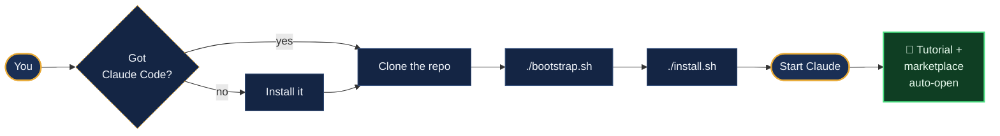

# Quickstart

**5 minutes · 3 steps · any OS · CLI or Desktop.**



---

## Step 0 · Do you have Claude Code?

Pick whichever works for you — the rest of the guide is identical.

| | CLI (terminal) | Desktop app |
|---|---|---|
| **Who it's for** | Engineers, DevRel, power users | Everyone else — educators, biz-dev, marketing, legal, exec |
| **How to get it** | `brew install anthropic/tap/claude` (macOS) · `npm i -g @anthropic-ai/claude-code` · [claude.com/claude-code](https://claude.com/claude-code) | Download from [claude.com/claude-code](https://claude.com/claude-code) |
| **Verify** | `claude --version` | Open it once; sign in with your BSVA-provisioned account |

> [!TIP]
> Not sure which account to use? Ask DevRel — BSVA provisions Anthropic accounts for you. Don't use a personal account for BSVA work.

---

## Step 1 · Clone the repo

```bash
git clone https://github.com/MatiasJF/bsva-ai-structure.git ~/bsva-ai-structure
cd ~/bsva-ai-structure
```

<details>
<summary><b>Where should it live? Will it break anything?</b></summary>

**Good places:** any user-writable folder — `~/bsva-ai-structure`, `~/Code/bsva-ai-structure`, `~/work/bsva/ai-structure`. The scripts resolve absolute paths at install time, so location doesn't matter.

**Avoid:**

| Location | Why not |
|---|---|
| `/usr/local`, `/opt`, `C:\Program Files` | needs admin; no benefit |
| iCloud Drive, Dropbox, OneDrive, Google Drive | sync conflicts corrupt git |
| Paths with spaces | bash tooling sometimes trips |
| Network shares | slow, breaks when disconnected |

**What the installer touches on your machine** — all under `~/.claude/`, all backed up before any change:

| Path | What happens | Safe? |
|---|---|---|
| `~/.claude/CLAUDE.md` | backed up → BSVA version installed | ✓ backup |
| `~/.claude/skills/<bsva-names>/` | BSVA-named skills backed up + replaced; other skills untouched | ✓ backup + others preserved |
| `~/.claude/mcp.bsva-template.json` | new template file (you merge manually) | — new file |
| `~/.claude/settings.bsva-template.json` | new template file | — new file |
| `~/.claude/settings.json` | **only if you say Yes** to the hook merge: backed up → BSVA SessionStart hook added; your other settings preserved | ✓ backup + idempotent |
| `~/.claude/.bsva-department`, `.bsva-welcome-shown` | small flag files | — new files |

**What the installer NEVER touches:**
- Your projects, code, git repos
- Your `~/.claude/mcp.json` (you merge the template yourself)
- SSH / GPG keys (explicitly denied in the settings template)
- System folders — `/etc`, `/usr`, `C:\Windows`, etc.

**Backup location:** `~/.claude/.bsva-backup/<timestamp>/`. To restore anything, copy back from there.

**Your actual BSVA projects** live wherever you already keep code (`~/projects/`, `~/Code/`, …). The install at `~/bsva-ai-structure/` is a reference repo and toolkit; individual projects symlink or copy `departments/<your-dept>/CLAUDE.md` into themselves.

</details>

<details>
<summary><b>Windows PowerShell</b> — same idea, different path separator</summary>

```powershell
git clone https://github.com/MatiasJF/bsva-ai-structure.git $HOME\bsva-ai-structure
cd $HOME\bsva-ai-structure
```
</details>

<details>
<summary><b>Prefer SSH?</b></summary>

If you have an SSH key linked to GitHub, you can clone over SSH instead:

```bash
git clone git@github.com:MatiasJF/bsva-ai-structure.git ~/bsva-ai-structure
```
</details>

---

## Step 2 · Run the bootstrap (first time only)

The bootstrap checks for the two tools BSVA needs — `git` and `Python 3` — and installs anything missing. **It asks before each install; nothing happens silently.**

<table>
<tr><th>macOS / Linux</th><th>Windows</th></tr>
<tr><td>

```bash
./bootstrap.sh
```

</td><td>

```powershell
.\bootstrap.ps1
```

</td></tr>
</table>

What it does:

- ✓ Detects your OS + package manager (brew / apt / dnf / winget / choco).
- ✓ Reports which tools are present.
- ✓ Asks before installing each missing one.
- ✓ Tells you what's still left.

> [!NOTE]
> Node.js is **not** required for the tutorial or marketplace. It's only needed if you work on DevRel's SDK example templates.

> [!WARNING]
> On Linux, installing packages requires `sudo`. If you don't have sudo on your work machine, ask your admin to install `git` and `python3` once — the rest runs as your user.

<details>
<summary><b>Only want to check, not install?</b></summary>

```bash
./bootstrap.sh --check          # macOS / Linux
.\bootstrap.ps1 -Check          # Windows
```
</details>

---

## Step 3 · Run the installer

This is the step that actually wires BSVA into your Claude.

<table>
<tr><th>macOS / Linux</th><th>Windows</th></tr>
<tr><td>

```bash
./install.sh
```

</td><td>

```powershell
.\install.ps1
```

</td></tr>
</table>

You'll be asked two things:

1. **Which department are you in?** Pick 1–4.
2. **Merge the SessionStart hook into `~/.claude/settings.json`?** → **Yes.** This makes the tutorial and marketplace open automatically the next time you start Claude.

When it's done, you can optionally open the tour + marketplace immediately. Say yes — it takes 10 minutes.

---

## That's it. Start Claude.

```bash
claude                # CLI
# or launch the Claude Desktop app
```

On this first session, your browser will open **two tabs**:

```
🎓 The Tutorial                    🏪 The Marketplace
────────────────                   ────────────────
A 10-minute walkthrough.           A searchable catalog of 150+
Sections, hero cards, the          items — skills, MCPs, templates,
10-step cycle, security,           workflow docs, guides. Organized
your department playbook.          by scope and type.
```

The hook fires **once**. Every later Claude session stays silent.

---

## Daily use

You can stop reading here. Everything below is "when you need it."

---

### Open the tour or marketplace any time

From a Claude session, just ask:

> "Open the tutorial"
> "Show me the marketplace"
> "What skills are available?"

The `open-tutorial` and `open-marketplace` skills take care of the rest.

Or from a terminal:

```bash
./tutorial/start.sh              # tutorial
./tutorial/start.sh marketplace  # marketplace
```

### Pulling updates

```bash
cd ~/bsva-ai-structure
git pull
./install.sh --sync              # refresh global skills without re-asking department
```

### Starting a new BSVA project

```bash
cp -R ~/bsva-ai-structure/departments/<your-dept>/templates/<template> ~/projects/my-thing
cd ~/projects/my-thing
ln -s ~/bsva-ai-structure/departments/<your-dept>/CLAUDE.md CLAUDE.md
git init && git add . && git commit -m "scaffold"
claude
```

---

## Troubleshooting

<details>
<summary><b>bootstrap.sh: "Homebrew not found"</b> (macOS)</summary>

Install Homebrew once, then re-run `bootstrap.sh`:

```bash
/bin/bash -c "$(curl -fsSL https://raw.githubusercontent.com/Homebrew/install/HEAD/install.sh)"
```
</details>

<details>
<summary><b>install.sh: "Missing required tools"</b></summary>

You skipped the bootstrap. Run it first:

```bash
./bootstrap.sh
```

Or, if you know you have the tools on a non-standard PATH:

```bash
./install.sh --skip-preflight
```
</details>

<details>
<summary><b>Tutorial didn't auto-open when I started Claude</b></summary>

The hook fires once. If you already ran it:

```bash
# macOS / Linux
rm ~/.claude/.bsva-welcome-shown

# Windows
Remove-Item $HOME\.claude\.bsva-welcome-shown
```

Then restart Claude. Or just ask Claude: *"open the tutorial"*.
</details>

<details>
<summary><b>Browser tab shows "This page needs a local server"</b></summary>

You opened `tutorial/index.html` directly from the file system. Use the launcher:

```bash
./tutorial/start.sh
```

It starts a tiny local server at `http://localhost:8765/` automatically.
</details>

<details>
<summary><b>"Claude Code can't find my Nestr MCP"</b></summary>

The installer wrote an MCP template to `~/.claude/mcp.bsva-template.json`. Merge it into your real `~/.claude/mcp.json` and add your API key. See [`guides/for-humans/02-first-hour-setup.md`](guides/for-humans/02-first-hour-setup.md).
</details>

<details>
<summary><b>I pasted something I shouldn't have</b></summary>

Go straight to [`security/incident-response.md`](security/incident-response.md). Blameless reporting is how BSVA stays safe — silence is worse than disclosure.
</details>

---

## Where things live

```
~/bsva-ai-structure/          ← the cloned repo (this)
├── bootstrap.sh / .ps1        ← prereq installer
├── install.sh / .ps1          ← BSVA installer
├── tutorial/                  ← the guided tour
├── marketplace/               ← the catalog viewer
├── global/                    ← skills + MCPs every BSVA person gets
├── departments/               ← per-department skills, templates, workflows
├── workflow/                  ← the 10-step cycle
├── guides/                    ← human + Claude guides
└── security/                  ← classification, incident response

~/.claude/                    ← your personal Claude config
├── CLAUDE.md                  ← base BSVA instructions (installed by install.sh)
├── settings.json              ← your settings + the BSVA SessionStart hook
├── mcp.json                   ← your MCP server config (merge from template)
└── skills/                    ← installed global skills (copied from repo)
```

---

## Getting help

- Stuck on install?  → DevRel (see [CODEOWNERS](CODEOWNERS))
- Security question?  → [`security/incident-response.md`](security/incident-response.md)
- Claude Code itself?  → [claude.com/claude-code](https://claude.com/claude-code)
- Want deeper docs?   → [README.md](README.md) and [`guides/for-humans/`](guides/for-humans/)

---

<div align="center">

**That's the whole quickstart.**
Got BSVA? Got Claude? You're ready.

</div>
