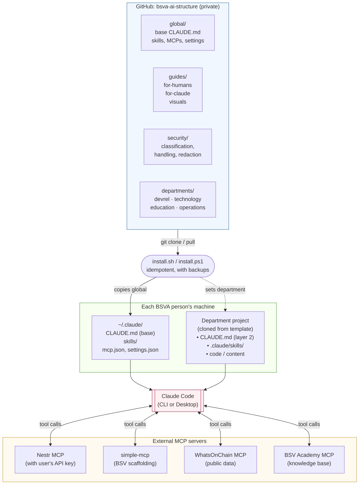

# 01 — System architecture

How the BSVA AI structure fits together: the repo, each person's `~/.claude/`, department projects, and MCPs.

---

---

## Walkthrough

1. **The repo** is the single source of truth for BSVA's Claude guidance. DevRel owns it; departments have write access to their own folders.
2. **The installer** is run once per machine (plus `--sync` after `git pull`). It copies the `global/` pieces into `~/.claude/` and records which department the user belongs to.
3. **The user's `~/.claude/`** is their personal Claude environment. The installer writes the base `CLAUDE.md`, skills, and settings templates here. The user layers their own personal settings on top.
4. **A department project** is created from a department template. Its `CLAUDE.md` is layer 2 of the context stack — it extends, never replaces, the base.
5. **Claude** reads both layers (base + department + any project-specific `CLAUDE.md`) at the start of every session.
6. **MCPs** extend Claude's reach. The four global ones are configured at the user level. Departments can add their own at the project level.

---

## Ownership / RACI

| Step | Responsible | Accountable | Consulted | Informed |
|---|---|---|---|---|
| Repo changes | PR author (in dept folder) or DevRel (global) | DevRel Lead | Security (global/ or security/) | All BSVA |
| Installer changes | DevRel | DevRel + Security | – | All BSVA |
| Personal `~/.claude/` setup | The user | The user | DevRel if stuck | – |
| Department project template | Department Lead | Department Lead | DevRel | All BSVA |
| MCP credentials | The user | The user | Security | – |

---

## See also

- [02 — Onboarding flow](02-onboarding-flow.md) — how a new person travels this architecture on day one.
- [03 — Skill lifecycle](03-skill-lifecycle.md) — how new skills enter the repo.
- `security/authorization-model.md` — what each of these surfaces can and cannot access.
