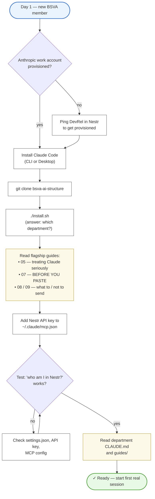

# 02 — Onboarding flow

A new BSVA person, from day 1 to first productive Claude session.

---

---

## Walkthrough

1. **Account check.** Before anything technical, confirm the person has a BSVA-provisioned Anthropic account. Personal accounts are not permitted for BSVA work — data handling terms differ.
2. **Install Claude Code.** CLI for engineers, Desktop for most other roles. Both surfaces are supported by the BSVA structure.
3. **Clone the repo and run the installer.** The installer copies global skills and MCPs, installs the base `CLAUDE.md`, and asks which department the person belongs to.
4. **Read the flagship guides first.** Before their first real session, the person reads the three human-first guides: `05-treating-claude-seriously`, `07-BEFORE-YOU-PASTE`, `08` + `09`. This is non-negotiable onboarding.
5. **Wire up Nestr.** Nestr is BSVA's operational backbone; Claude needs access via MCP to be useful.
6. **Verify.** A simple "who am I in Nestr" query proves the MCP is wired correctly.
7. **Read department-specific materials.** The department's `CLAUDE.md` and `guides/` in `departments/<dept>/` set the per-department context.
8. **First session.** Ready.

---

## Timing

- **Step 1–3**: 20 minutes.
- **Step 4** (read flagship guides): 15 minutes.
- **Step 5–7**: 10 minutes.
- **Step 8** (dept reading): 30–60 minutes, varies by department.

**Total: under 2 hours** for a new member to be fully onboarded and safe.

---

## Ownership / RACI

| Step | Responsible | Accountable |
|---|---|---|
| Account provisioning | DevRel + IT | DevRel Lead |
| Installer / structure | DevRel | DevRel Lead |
| Flagship guides content | DevRel + Security | DevRel Lead |
| Department materials | Department Lead | Department Lead |
| The person actually reading | The new member | The new member |

---

## See also

- `guides/for-humans/02-first-hour-setup.md` — the human-facing version of this flow.
