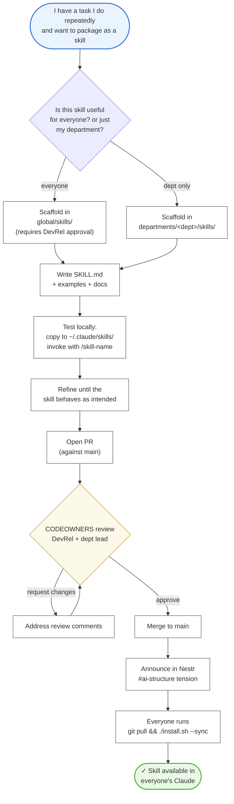

# 03 — Skill lifecycle

How a new skill enters the repo and reaches everyone's Claude. **This is the core collaboration loop** that turns one person's good idea into an organization-wide capability.

---



---

## Walkthrough

### Step 1 — Identify the skill
A "skill" is a re-usable Claude capability: a prompt template + possibly code + docs. If you've re-typed the same instructions three times, **it deserves to be a skill**.

### Step 2 — Pick the scope
- **Global** (`global/skills/`) — useful to every BSVA person regardless of department. Requires DevRel approval, because it ships to every machine.
- **Department** (`departments/<dept>/skills/`) — useful for one department. Owned by the department.

### Step 3 — Scaffold
Use the department's `new-skill/` template (see `departments/<dept>/templates/` — each department has one). It creates a directory with a `SKILL.md`, example inputs, and any helper scripts.

Minimum `SKILL.md` frontmatter:
```yaml
---
name: my-skill-name
description: One-line description of when Claude should invoke this. Be specific — this is how Claude decides to use it.
classification: Internal   # default; override per content
owner: "@bsva/my-dept"
---
```

### Step 4 — Test locally
Copy the skill directory into `~/.claude/skills/` (or the department-scoped skills path). Invoke `/my-skill-name` in Claude and verify the behavior.

### Step 5 — Refine
Expect 2–5 rounds of tuning the description (so Claude invokes it at the right moments) and the body (so the output is right).

### Step 6 — PR and review
Open a PR. CODEOWNERS routes it to the right reviewers. Global skills always need DevRel; sensitive skills (legal, HR-adjacent) also need security review.

### Step 7 — Merge and sync
Once merged, announce in Nestr so the org knows to sync. Everyone runs `git pull && ./install.sh --sync` at their convenience — the next session will pick up the skill.

---

## Common mistakes

- **Scaffolding a global skill when a department skill would do.** Global = more review burden. Start narrow.
- **Vague `description` field.** Claude chooses skills by description; a vague one will either misfire or never fire. Iterate on it.
- **No examples.** A skill with no example inputs is hard for reviewers to test. Include 2–3.
- **Skipping local test.** Don't PR a skill you haven't used.
- **Embedding Confidential content in examples.** The skill is committed to the repo — examples must be Public-safe.

---

## Ownership / RACI

| Step | Responsible | Accountable |
|---|---|---|
| Scaffold + draft | Skill author | Skill author |
| Local test | Skill author | Skill author |
| PR review | CODEOWNERS | DevRel Lead (for global) or Dept Lead (for dept) |
| Security review (if required) | Security | Security Lead |
| Announce + sync | Skill author + DevRel | DevRel Lead |

---

## See also

- [04 — MCP lifecycle](04-mcp-lifecycle.md) — same shape, for MCPs.
- [06 — Project scaffolding](06-project-scaffolding.md) — how to use a skill in a new project.
- `departments/developer-relations/guides/how-to-start-a-project.md` — the authoring conventions.
