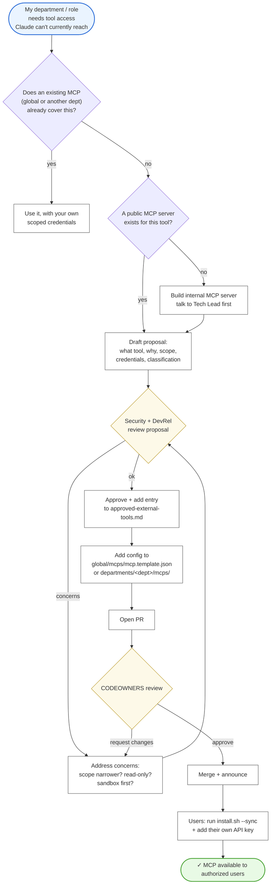

# 04 — MCP lifecycle

How a new MCP (tool connection) enters the BSVA stack. MCPs are higher-risk than skills because they often ship with **credentials and read/write access to external systems**. Review is stricter.

---

---

## Walkthrough

### Step 1 — Check for existing MCPs
The four global MCPs (Nestr, simple-mcp, WhatsOnChain, BSV Academy) cover a lot. Department MCPs cover more. Check before proposing new.

### Step 2 — Find or build the MCP server
- **Public MCP server exists** (npm / GitHub): prefer it. Pin to a specific version in `mcp.template.json`.
- **No public server**: talk to the Tech Lead. Building an internal MCP server is a bigger lift and requires more review.

### Step 3 — Draft the proposal
Required fields:
- What tool does the MCP connect to?
- What department/roles need it, and why?
- Scope: read-only or read/write?
- Credentials: how scoped (workspace-level? project-level? per-user?)
- Data classification: what tier does it expose Claude to?
- Failure modes: what happens if the MCP misbehaves?

Post the proposal as a Nestr tension in DevRel + Security circles.

### Step 4 — Security + DevRel review
Reviewers check:
- Is the access scoped as narrowly as possible?
- Could this MCP exfiltrate Confidential data if misconfigured?
- Does the vendor have appropriate data-handling terms?
- Is there a safer alternative?

Expect iteration.

### Step 5 — Approve and update config
Once approved:
1. Add an entry to `security/approved-external-tools.md`.
2. Add the config stub to `global/mcps/mcp.template.json` (global) or `departments/<dept>/mcps/` (dept).
3. Document any secret-handling in `departments/<dept>/guides/`.

### Step 6 — PR and merge
CODEOWNERS review routes to both DevRel and Security for global MCPs. Merge only with both approvals.

### Step 7 — Users install
After `git pull && ./install.sh --sync`, users must still **add their own credentials**. The installer writes templates; it does not copy anyone else's secrets.

---

## Specific risks to watch

### Read vs write
A read-only MCP is much lower-risk than a read/write one. Always default to read-only; escalate to write only with explicit review.

### Credential exfiltration
If a user accidentally pastes content containing a secret into a session with an MCP that has external network access, the secret can leave the machine. Tight permissions matter.

### Rate limits and DoS
A misbehaving MCP can be spammed by Claude if prompts are looped. Always ensure the MCP you add respects rate limits and the vendor is aware.

### Dependency trust
`npx -y @some-org/mcp-server@latest` pulls arbitrary JavaScript from npm. **Pin versions** and verify the publisher before depending on it.

---

## Ownership / RACI

| Step | Responsible | Accountable |
|---|---|---|
| Proposal | Requesting role | Department Lead |
| Security review | Security | Security Lead |
| Configuration | DevRel (global) or Dept (scoped) | DevRel Lead or Dept Lead |
| Credential management | The user | The user |
| Incident response | Security | Security Lead |

---

## See also

- [03 — Skill lifecycle](03-skill-lifecycle.md) — lighter-weight additions.
- `security/authorization-model.md` — what MCPs can and cannot do.
- `security/approved-external-tools.md` — the canonical approved list.
