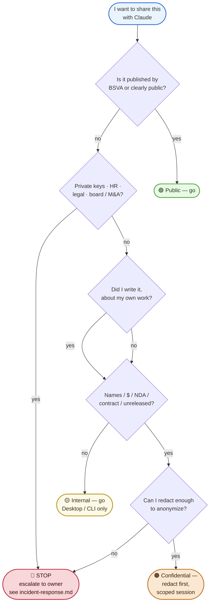

# 05 — Pre-flight classification (human decision tree)

The 30-second check every BSVA person does before pasting anything into Claude. Visual form of `guides/for-humans/07-BEFORE-YOU-PASTE.md`.

---

---

## The path in plain English

1. **Published and public already?** → Go. No tier concerns.
2. **Private keys, HR, contracts, board/exec material?** → STOP. Don't paste.
3. **Names / amounts / NDA / unreleased** in the content? → You need to redact or stay at Internal.
4. **Can you redact it cleanly?** → Yes, treat as Confidential with a scoped session. No, STOP.

---

## The decision, timed

This should take **30 seconds** after the first week of practice. Example real sessions:

> "I want to ask Claude to polish this draft blog about BRC-100." → published topic, my draft → 🟢.
> "I want Claude to summarize these internal OKR notes." → my department's notes, no partner names, no HR → 🟡.
> "I want Claude to review this proposed contract clause with Partner A." → names, $, legal → **redact** → 🟠 or escalate.
> "I want Claude to help me format this list of test private keys for a workshop." → **STOP**, use documented test vectors instead.

---

## Where the full rules live

- `guides/for-humans/07-BEFORE-YOU-PASTE.md` — prose form.
- `guides/for-humans/11-information-handling.md` — the 4-tier matrix.
- `security/classification.md` — source of truth for tier definitions.
- `security/data-handling-matrix.md` — what you may do with each tier.

---

## See also

- [07 — Incident response](07-incident-response.md) — what to do when pre-flight failed.
