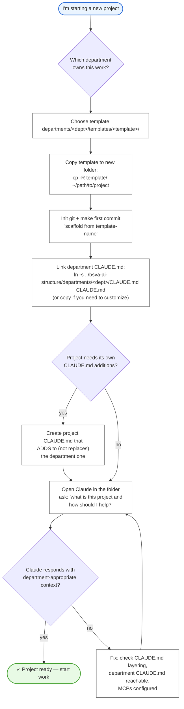

# 06 — Project scaffolding

How to start a new project so Claude has the right context from minute one.

---



---

## Walkthrough

### Step 1 — Pick department and template
Each department has templates under `departments/<dept>/templates/`. Examples:
- `developer-relations/templates/new-workshop/`
- `developer-relations/templates/new-sdk-example/`
- `technology/templates/new-service/`
- `education/templates/new-course-module/`

Pick the one that matches the scope of your work. If none fit, use the closest match and customize.

### Step 2 — Copy, don't symlink the template
```bash
cp -R ~/bsva-ai-structure/departments/developer-relations/templates/new-workshop \
      ~/projects/my-new-workshop
cd ~/projects/my-new-workshop
git init
git add . && git commit -m "scaffold from new-workshop template"
```

Copying (not symlinking) lets the project evolve independently.

### Step 3 — Link the department CLAUDE.md
The project's root should have a `CLAUDE.md`. You can either **symlink** (auto-updates when the department version changes) or **copy** (stable, customizable).

**Symlink (recommended for most projects):**
```bash
ln -s ~/bsva-ai-structure/departments/developer-relations/CLAUDE.md CLAUDE.md
```

**Copy (if you need project-specific additions without affecting others):**
```bash
cp ~/bsva-ai-structure/departments/developer-relations/CLAUDE.md CLAUDE.md
# then edit CLAUDE.md with your project-specific additions
```

### Step 4 — Optional: project-specific CLAUDE.md additions
If the project has context Claude needs beyond the department default (a specific SDK version, a particular audience, a unique deployment constraint), add it to the project's CLAUDE.md. Layering: **extend, don't replace**.

### Step 5 — Verify
Open Claude in the folder. Ask it a grounding question:

> "What is this project about and what's the most helpful way you can assist here?"

A well-linked project produces an answer that references your department's voice, your project's purpose, and any BSVA-wide security rules. A broken linkage produces generic answers.

### Step 6 — Fix if needed
If Claude is generic:
- Confirm `CLAUDE.md` is in the project root and readable.
- Confirm the department `CLAUDE.md` it links to exists and is readable.
- Confirm you ran `install.sh` — the base `~/.claude/CLAUDE.md` must be present.
- Restart the Claude session (`/clear` or reopen).

---

## Template anatomy

A good template includes:

```
templates/new-workshop/
├── CLAUDE.md              (or a symlink to dept/CLAUDE.md)
├── README.md              what this template produces
├── .gitignore
├── src/
├── docs/
├── examples/
└── .claude/
    └── skills/            any project-specific skills
```

The template is not sacred — fork, modify, propose improvements back via PR.

---

## Ownership / RACI

| Step | Responsible | Accountable |
|---|---|---|
| Maintaining templates | Department Lead | Department Lead |
| Choosing a template | Project author | Project author |
| Scaffolding a project | Project author | Project author |
| Proposing template improvements | Project author | Department Lead |

---

## See also

- `departments/<your-dept>/templates/` — the templates for your department.
- `departments/<your-dept>/guides/how-to-start-a-project.md` — department-specific setup notes.
