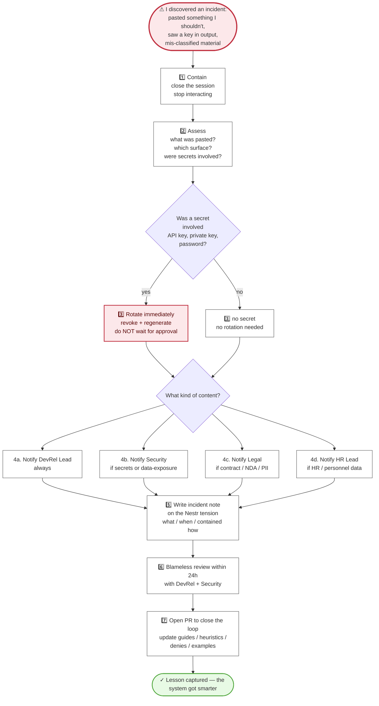

# 07 — Incident response

What happens when something slips through: pasted content that shouldn't have been, a secret that leaked, a mis-classified document. Visual form of `security/incident-response.md`.

---

---

## The principle

**Silence is the worst outcome. Disclosure is how BSVA's guidance gets sharper.**

Incidents are not career events. They are opportunities to close a gap in the system. Every merged PR that came out of an incident review makes the next person safer.

---

## Timing

| Phase | Window |
|---|---|
| Contain | seconds |
| Rotate (if secrets) | immediately — before anything else |
| Notify | within 1 hour for Confidential/Restricted; within a business day for Internal |
| Write note | same day |
| Blameless review | within 24 hours |
| Close the loop (PR) | within 1 week |

---

## What NOT to do

- ❌ "Just delete it and move on" — the content left your machine.
- ❌ "Ask a colleague in Slack for their opinion" — broadens exposure.
- ❌ "Wait till Monday" — rotation especially cannot wait.
- ❌ "Hope Anthropic doesn't store it" — not a strategy.
- ❌ Confess publicly — use the Nestr tension, not a general channel.

---

## The blameless part

BSVA's policy:

- Good-faith reporters are not punished for reporting.
- Repeat incidents of the same type get a process review, not a blame review.
- Serious incidents (Restricted breach, willful bypass of rules) are handled by Legal + Exec separately — but even those start from a norm of protecting the reporter.

---

## Ownership / RACI

| Phase | Responsible | Accountable |
|---|---|---|
| Contain | The user | The user |
| Rotate | The user (+ IT if needed) | The user |
| Notify | The user | DevRel Lead |
| Write note | The user | DevRel Lead |
| Blameless review | DevRel + Security | DevRel Lead |
| Guidance PR | Incident stakeholders | DevRel Lead |

---

## See also

- `security/incident-response.md` — full prose version of this flow, with specific-incident playbooks.
- `guides/for-humans/12-when-to-escalate.md` — escalation in general (not just incidents).
